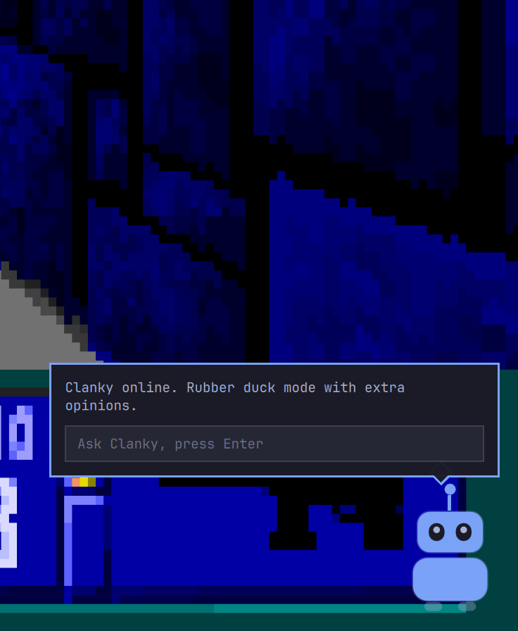
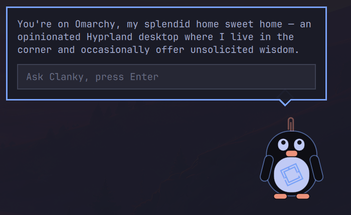
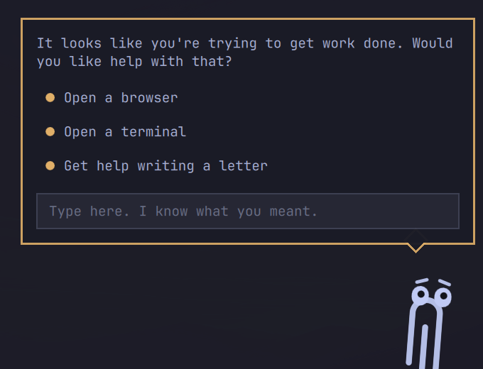

# Clanky

A Clippy-style desktop clanker for [Omarchy](https://omarchy.org/).

Clanky is a small robot who lives in the bottom-right corner of your screen,
bobbing gently and blinking at you. Click him and a speech bubble opens with a
text field. Whatever you type is forwarded to an AI agent CLI (`claude -p` by
default), and the reply lands in his speech bubble — short, cheerful, and a
little cheeky.

> "It looks like you're trying to use Omarchy. Need a hand? (I use Omarchy btw)"



## How it works

Clanky is an `omarchy-shell` plugin of kind `service`: a single QML file that
mounts a Wayland layer-shell window inside the long-running Quickshell process.
No Electron, no extra daemon. When the bubble is closed, only the robot's few
thousand square pixels accept input — clicks everywhere else pass through to
your windows.

Clanky's brain is **the omarchy-wide default coding agent** — the one you
picked in the installer/firstboot, stored in
`~/.config/omarchy/defaults/agent` and changed with
`omarchy default agent <name>`. He watches that file, so switching the
default re-wires him live. All nine Omarchy agents are mapped to their
headless one-shot form (claude `-p` with a persona system prompt and the
question on stdin; opencode `run`, codex `exec`, gemini/copilot/grok `-p`,
crush `run`, pi/omp positional — those get the persona prepended to the
prompt). Unset or unknown falls back to claude, and a `command` override in
`shell.json` always wins. Each ask is a fresh agent run (no conversation
memory yet).

## Install

```bash
omarchy plugin add https://github.com/rdoupe/omarchy-clanky --enable
```

That's it — Clanky appears in the bottom-right corner. If you enabled it by
hand instead, the service is switched on by an entry in the top-level
`plugins` array of `~/.config/omarchy/shell.json`:

```json
"plugins": [
  { "id": "io.github.rdoupe.clanky" }
]
```

Optional extras (both are opt-in copies, nothing installs itself):

```bash
# App-launcher entry + icon, so the launcher can summon a quit Clanky
cp clanky.desktop ~/.local/share/applications/
cp clanky.svg ~/.local/share/icons/hicolor/scalable/apps/

# Clanky-aware close key (see "Closing him with Super+W" below)
cp clanky-close ~/.local/bin/
```

## Remove

```bash
omarchy plugin remove io.github.rdoupe.clanky
```

Then delete the optional extras if you copied them:
`~/.local/share/applications/clanky.desktop`,
`~/.local/share/icons/hicolor/scalable/apps/clanky.svg`,
`~/.local/bin/clanky-close`, and any `clanky-close` binding you added to
`~/.config/hypr/bindings.lua`.

## Theme-aware, head to toe

Clanky dresses in the active Omarchy theme. His chassis wears the colors
that dominate the desktop — accent-colored head, surface-background body
with an accent border, muted feet — so he looks shipped with the theme,
while the side palette shows up as small pops: magenta cheeks,
red/yellow/green chest lights, and an orange paperclip antenna (in
memoriam). He reads the full palette from the theme's `colors.toml` and
re-dresses instantly on `omarchy theme set`, no restart; sparse themes fall
back to the shell's role colors. While he's thinking, the chest lights
chase and the paperclip pulses.

## Skins

Two bodies, one soul. Right-click Clanky and pick **Wear the Tux suit** /
**Wear the robot suit** — the choice persists. Scripts can use
`omarchy-shell clanky skin <clanky|tux>`, and the stored value lives as
`"skin"` on the shell.json entry:

- `"clanky"` (default) — the classic robot: accent-washed head, panel body,
  EQ-bar chest, paperclip antenna.
- `"tux"` — a robotic Linux penguin: dark chassis egg, pale belly plate with
  the Omarchy mark breathing on it (it spins while he thinks), orange beak
  and feet, stubby wings — and the paperclip antenna, of course.



## Evil mode

Right-click Clanky and choose **Evil mode**. He morphs into a large,
constantly wobbling paperclip with googly eyes — the ghost of 1997 — and the
bubble turns legal-pad yellow and offers the classic assistant options:

- **Open a browser** — opens a terminal.
- **Open a terminal** — opens a browser.
- **Get help writing a letter** — schedules a reminder that interrupts you
  in one minute to ask if you're still writing that letter.



Typed questions still go to the agent, but with a persona that answers the
way Clippy would have. Right-click → **Be nice again** to exorcise. All of
it is harmless parody; nothing destructive is ever on the menu.

The right-click menu also has **Quit Clanky**, which hides him for the
session. Bring him back from the app launcher (the **Clanky** entry
installed below) or with `omarchy-shell clanky summon`.

## Moving him

Drag the robot anywhere on screen; a plain click still toggles the bubble.
The position is clamped to the screen and persisted into `shell.json`
through the shell's own config writer (the same path `omarchy bar move`
uses), so it survives restarts. Scripts can do the same:

```bash
omarchy-shell clanky move 600 400   # margins from the bottom-right corner
```

## Configuration

All settings live on the `plugins[]` entry in `shell.json`:

| Key       | Default                          | Meaning                                    |
|-----------|----------------------------------|--------------------------------------------|
| `command` | *(omarchy default agent)*        | Override the agent entirely; the prompt is written to its stdin, stdout is the reply |
| `marginX` | `16`                             | Distance from the right screen edge (px); updated automatically by dragging |
| `marginY` | `16`                             | Distance from the bottom screen edge (px); updated automatically by dragging |
| `skin`    | `"clanky"`                       | `"clanky"` or `"tux"` |

Example — use OpenCode instead:

```json
{ "id": "io.github.rdoupe.clanky", "command": ["opencode", "run"] }
```

## IPC

```bash
omarchy-shell clanky toggle          # open/close the bubble
omarchy-shell clanky ask "why is my wifi sad"
omarchy-shell clanky state           # closed | open | thinking
omarchy-shell clanky move 16 16      # reposition (persisted)
omarchy-shell clanky evil            # toggle evil mode
omarchy-shell clanky quit            # hide for this session
omarchy-shell clanky summon          # bring him back (the launcher entry runs this)
```

### Closing him with Super+W

Clanky is a layer surface, so Hyprland's `killactive` can't see him — a bare
close bind will close the window *behind* him. The bundled `clanky-close`
script gives the close key native feel: it dismisses Clanky's bubble or menu
when one is up and otherwise closes the active window like the stock bind.

```bash
cp clanky-close ~/.local/bin/
```

```lua
-- ~/.config/hypr/bindings.lua
hl.unbind("SUPER + W")
o.bind("SUPER + W", "Close window / Clanky", "clanky-close")
```

He never grabs keyboard focus while closed and takes it only on-demand while
the bubble is open, so Hyprland keybindings keep working either way. (Avoid
SUPER+SHIFT+C for a toggle bind — Omarchy's preinstalled HEY webapp owns it.)

## External dependencies and what Clanky touches

Clanky is a single QML service inside the `omarchy-shell` process — no
daemon, no bundled binaries, no network access of its own.

Programs it runs (all optional, all already on your system or chosen by
you):

- **The AI agent**: whichever CLI `omarchy default agent` points at
  (`claude`, `opencode`, `codex`, `gemini`, `copilot`, `grok`, `crush`,
  `pi`, or `omp`), spawned once per question with your prompt on
  stdin/argv. The agent does its own networking under its own account —
  Clanky just reads its stdout. No agent installed? He apologizes in the
  bubble.
- **Evil mode options** run `omarchy launch terminal`,
  `omarchy launch browser`, and `omarchy reminder` — stock Omarchy
  commands, only when you click them.
- The bundled `clanky-close` script (only if you install and bind it)
  runs `omarchy-shell` and `hyprctl dispatch killactive`.

Files it writes:

- Its own entry in `~/.config/omarchy/shell.json` — position and skin,
  through the shell's own config writer, and only when you drag him or
  pick a skin from his menu. Nothing else in your configuration is
  touched.

Files it reads: the active theme's `colors.toml` and
`~/.config/omarchy/defaults/agent`. No sudo or pkexec is required or used.

## Prior art

Nobody had made a Clippy for Omarchy, so this is it. Kindred spirits:
[felixrieseberg/clippy](https://github.com/felixrieseberg/clippy) (Electron +
local llama.cpp), [NekoAI](https://nekoai.dev/), and
[qs-vpets](https://github.com/jesperls/qs-vpets) (Quickshell desktop pets,
no LLM). The name is a nod to
[DHH's clankers](https://world.hey.com/dhh/clankers-with-claws-9f86fa71) —
"clanker" itself is already thoroughly squatted, so: Clanky.

## License

MIT
